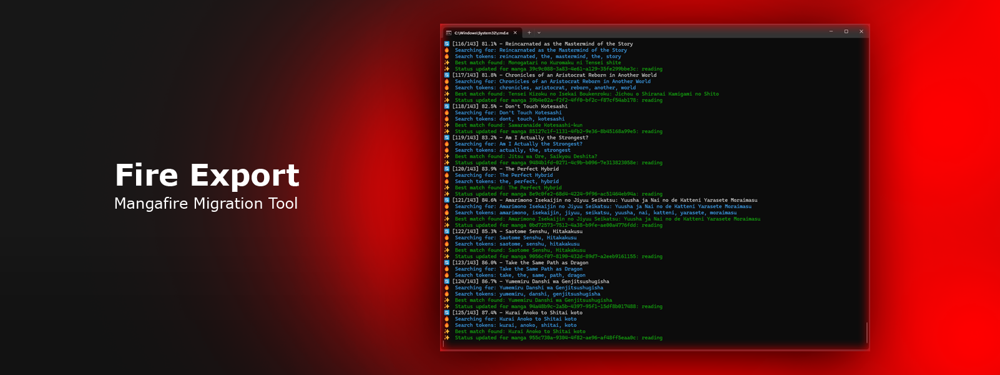

# 🔥 Fire Export

*Export & Import your manga library from Mangafire to other platforms*

> ⚠️ **CAUTION**: Use this tool at your own risk. Always review source code before executing any scripts.

## 📝 Description

FireExport helps you migrate your manga library from Mangafire to other manga reading platforms seamlessly. Perfect for managing your collection across different services.

## 🚀 Installation

1. Get the latest release from our [releases page](https://github.com/karrot0/FireExport/releases)
2. Extract ZIP to your preferred location
3. Open terminal in extracted directory
4. Run: `npm install`

## 📖 Usage

1. Visit https://mangafire.to/user/list/export
    - Enable "Group by Folder"
    - Enable "MAL XML"
    - Export to project directory as `export.xml`

2. Rename `.env.example` to `.env`

3. Configure Mangadex credentials in `.env` (proceed with caution)

4. Set up API access:
    - Go to https://mangadex.org/settings
    - Navigate to "API Clients"
    - Create new API client
    - Wait for approval

5. Once approved:
    - Click "Get Key" → paste into `MANGADEX_CLIENT_SECRET`
    - Copy personal-client ID → paste into `MANGADEX_CLIENT_ID`

6. Run: `node mangadex_import.js`

## 🔧 Testing

To test the script, follow Usage steps and modify `mangadex_import.js` (lines 284-290):
- Uncomment to reset defaults after testing

## ⚙️ Requirements

- Node.js (v16.0.0+)
- NPM
- Modern web browser
- Valid Mangafire account